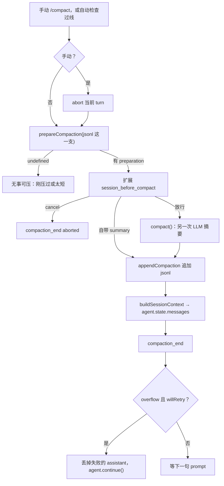

# Compaction 流程（v0.85.1）

对照课第 5 片把对话写成 jsonl。那只解决「下次还能接着问」。对话变长之后，模型的上下文窗口会满。直接截断会丢事实，所以一年后的产品改成：**把旧消息收成一份摘要，最近的原样留下，再送给下一轮模型。**

reconstruct 没有这一层。loop 也不决定何时压。触发、切点、摘要、写回都在 L2 的 `AgentSession`（分层见 [pi-v0.85.1-layers.md](pi-v0.85.1-layers.md)）。标本：`vendor/pi-v0.85.1/packages/coding-agent/`。官方说明书：[compaction.md](../../vendor/pi-v0.85.1/packages/coding-agent/docs/compaction.md)。本篇按因果把流程走一遍。

三件不要混：

| 东西 | 干什么 | 你已经见过的 |
|------|--------|--------------|
| 工具输出截断 | `tool_result` 太大，进模型前切掉 | 第 3 片，约 1 MB |
| session jsonl | 把发生过的事写到磁盘 | 第 5 片 `SessionManager` |
| compaction | 旧对话收成摘要，**下一轮 HTTP 少带原文** | 本篇 |

jsonl 文件**不会**因为压缩而改写旧行，只是新加一行 `type: "compaction"`。旧消息仍在文件里，给 `/tree` 和 fork 用；少掉的是送给模型的那一份。

另有 `/tree` 换分支时的 **branch summarization**：摘要格式和文件追踪与 compaction 共用，触发不同。第 8 节点一下，主流程是 compaction。

## 第 1 节：一次压缩穿过哪些文件

```text
手动：/compact、RPC、扩展          →  AgentSession.compact()（先 abort 当前 turn）
自动：run 结束 / 下一句 prompt 前  →  AgentSession._checkCompaction()
自动：turn 中间，工具刚跑完        →  AgentSession._compactBeforeNextAssistantResponse()
        ↓ 三条入口汇合
prepareCompaction()               纯函数：切点、要摘要的消息、上一份摘要
        ↓
扩展 session_before_compact       可取消，或自己交一份摘要
        ↓
compact() → generateSummary…()    另一次 LLM 调用，不跑工具
        ↓
SessionManager.appendCompaction() 往 jsonl 追加一行
        ↓
buildSessionContext()             摘要 + firstKept 之后的消息
        ↓
agent.state.messages = …          下一轮 loop 看见这份
convertToLlm()                    compactionSummary → 一段 user 文本
```

| 文件 | 职责 |
|------|------|
| [`agent-session.ts`](../../vendor/pi-v0.85.1/packages/coding-agent/src/core/agent-session.ts) | 何时压、abort、扩展钩子、写回 `agent.state.messages` |
| [`compaction/compaction.ts`](../../vendor/pi-v0.85.1/packages/coding-agent/src/core/compaction/compaction.ts) | `shouldCompact`、`prepareCompaction`、`compact`、找切点 |
| [`compaction/utils.ts`](../../vendor/pi-v0.85.1/packages/coding-agent/src/core/compaction/utils.ts) | 对话译成文本、追踪 `read` / `edit` / `write` 过的路径 |
| [`session-manager.ts`](../../vendor/pi-v0.85.1/packages/coding-agent/src/core/session-manager.ts) | 追加 `CompactionEntry`；`buildContextEntries` 重建给模型的列表 |
| [`messages.ts`](../../vendor/pi-v0.85.1/packages/coding-agent/src/core/messages.ts) | `role: "compactionSummary"` → `convertToLlm` 译成 user |

`@earendil-works/pi-agent-core` 的 harness 里还有一份 compaction。CLI / SDK 走的是 coding-agent 这一份。对照时读 coding-agent。

## 第 2 节：何时触发

三种 `reason`，不是三种压缩算法。切点和摘要函数是同一套。

| reason | 谁发起 | 压完后会不会 `agent.continue()` |
|--------|--------|--------------------------------|
| `manual` | `/compact`、RPC、扩展调 `session.compact()` | 不会。先 `abort()` 当前 turn |
| `threshold` | 用量过线 | 一般不续。已完成的回答留下；除非 `agent_end` 之后扩展又往队列塞了消息 |
| `overflow` | 模型说上下文爆了，或输出被长度截断且还能救 | 失败的那次先丢掉最后一条 assistant，压完再续 **一次** |

自动检查有两个入口，不是一处：

1. **`_checkCompaction(assistant)`**：拿「刚跑完的那条 assistant」当依据。两个调用点：
   - 一次 agent run 结束（`_handlePostAgentRun`，跟在 `agent_end` 后面）；
   - 下一句 user 发出去之前（`prompt()` 里，`skipAbortedCheck = false`，把「上一轮被 abort、还没检查」的情况补上）。
2. **`_compactBeforeNextAssistantResponse()`**：同一 run 里，工具跑完、下一发 assistant 还没开始（挂在 `prepareNextTurnWithContext` 上）。不看单条消息，直接估整个 `context.messages`。长 turn 中间就能压，不必等整句结束。

阈值公式：

```text
shouldCompact 当且仅当
  settings.enabled
  且 contextTokens > contextWindow - reserveTokens
```

默认 `reserveTokens = 16384`：给模型留回答的空位。`keepRecentTokens = 20000`：切点用，不是触发用。写在 `~/.pi/agent/settings.json` 或项目 `.pi/settings.json` 的 `compaction` 里。`enabled: false` 只关自动，`/compact` 仍可手动压。

`contextTokens` 从哪来，分两条路：

- **run 结束后的阈值检查**：用触发它的那条 assistant 自己报的 `usage.totalTokens`（没有就用 input / output / cache 各项相加）。
- **那条 assistant 是 error、或 usage 全 0**：退回 `estimateContextTokens(整份 messages)`——找最后一条带有效 usage 的 assistant 报数，它之后的消息（tool result 等）按「字符数 / 4」补上。这样 529 一类持续报错不会把账清零、再也压不成。turn 中间那个入口用的也是这份估算。

不会压的情况（简单就说简单）：

- 自动关了（`enabled: false`）
- 这条 assistant 是 `aborted`（用户取消）：run 结束后那次检查跳过它；prompt 前那次不跳
- 最后一条已经是 `compaction`（刚压过，还没有新消息）；手动压会报 "Already compacted"
- 切完之后没有东西可摘要（会话太短）；手动压会报 "Nothing to compact"
- 这条 assistant 的时间戳早于最新 compaction（防止压完立刻拿旧 usage 再压一次）
- 溢出报错来自**上一个模型**（刚切到更大窗口的模型，旧模型的溢出不该让新模型压）
- overflow 已经救过一次还失败：不再循环，发出错误事件

## 第 3 节：主流程

手动和自动在钩子之后汇合到同一个 `compact()`。



逐步：

1. **准备。** `prepareCompaction(pathEntries, settings)` 只看当前分支上的 session 条目。算出 `firstKeptEntryId`、要摘要的消息、是否在 turn 中间切开、上一份摘要、读过/改过的文件。（为什么需要上一份摘要，见第 4 节末尾。）
2. **扩展。** `session_before_compact` 可以 `cancel`，或直接给 `{ summary, firstKeptEntryId, tokensBefore, details }`。给了就不再调默认摘要模型。
3. **默认摘要。** `compact(preparation)` 把要扔掉的消息译成文本，再 POST 一次模型。这不是 loop 里那一轮，没有 function tool。摘要失败（error、被 maxTokens 截断、模型居然想调工具）整次压缩失败，**不会**把半截摘要写成 checkpoint。
4. **落盘。** `appendCompaction(...)` 在当前 leaf 下追加一条。jsonl 多一行，旧行不动。
5. **内存换一份。** `buildSessionContext()` 得到新的 `messages`，赋给 `agent.state.messages`。下一轮 `convertToLlm` 才会带上摘要。
6. **事件。** 皮订到 `compaction_start` / `compaction_end`。扩展另有 `session_compact` / `session_compact_failed`。取消走 AbortSignal，不要收成 `tool_result` + 失败。

手动路径会先 `abort()`。自动路径不 abort 整句：阈值压的是已经说完的上下文；溢出才可能 `continue()` 把同一句再问一次。

## 第 4 节：切点怎么找

`keepRecentTokens`（默认约 2 万 token）是「从尾巴往回留多少原文」。算法：

1. 只在「上一道 compaction 边界」到「现在」之间找。第一次压，边界是会话开头；再压一次，边界是上一份的 `firstKeptEntryId`（找不到就用上一份 compaction 的下一条）。上次留下的原文，这次可以收进新摘要。
2. 从最新一条往回加 token（字符 / 4，偏多估），加到 `>= keepRecentTokens` 停。
3. 停在最近的**合法切点**：user、assistant、`bashExecution`、custom、branch/compaction summary。**不要切在 `toolResult` 上**——结果必须跟它的 tool call 待在一起。切在带 tool call 的 assistant 上时，后面的 tool result 算「留下的」。
4. 切点不是 turn 起点（user、`bashExecution`、custom、summary 算起点，assistant 不算），就是 **split turn**：这一 turn 本身比预算还长。前面完整的 turn 做历史摘要；这一 turn 切开的前缀另做一份「turn prefix」摘要，再拼到一起。

```text
平常（切在 turn 边界）：

  [旧 user/assistant/tool] [旧 user/assistant] │ [最近 user … assistant … tool]
         messagesToSummarize                   │            留下
                                               firstKeptEntryId

split turn（一句里工具太多）：

  [更早的 turn]  [这一句的 user + 前几轮工具] │ [这一句末尾的 assistant+tool]
  历史摘要           turn prefix 摘要         │            留下
```

`tokensBefore` 按**压之前**重建出来的上下文估，不是按文件里全部历史行。反复压的时候，账反映的是模型实际在看的那一份。

### 为什么准备阶段要带上「上一份摘要」

第二次压的时候，`messagesToSummarize` 从上一道边界开始，**边界之前的原文不在里面**。而那些原文自第一次压完就不再进任何 HTTP 请求——它们唯一剩下的载体是上一份摘要。

```text
jsonl：  u1 a1 … u40 a40 │ cmp1 │ u41 a41 … u80 a80
                          firstKept=u41

第一次压：摘要模型读 u1…u40 的原文 → 写出 S1
第二次压：messagesToSummarize = u41…u60（只有这一截原文）
          u1…u40 在哪？只在 S1 的文字里
```

所以第二次摘要的输入必须是「S1 + 这截新原文」，让模型把新进展**合并进**旧摘要，写出 S2。不带 S1，S2 就只覆盖后半场；前半场的目标、决定、已做完的事，从模型视野里永久消失。

为什么不从 jsonl 开头把原文全重读一遍？那样每次摘要的输入都是整个会话历史，越压越长，压缩就失去意义。设计上必须是增量接力：每份新摘要 = 旧摘要 + 新增量。`previousSummary` 就是旧摘要进这次计算的入口；第一次压没有上一份，它是 `undefined`，走「从零写摘要」的 prompt。文件追踪（`details` 里读过 / 改过的路径）同理：从上一次 compaction 累加，不重扫旧行。

## 第 5 节：摘要那一次 HTTP 长什么样

不是把旧 `messages[]` 原样再 POST 一遍。模型若看见完整对话，会接着聊，而不是写 checkpoint。

1. `convertToLlm` 把 `bashExecution` 等译成普通消息。
2. `serializeConversation` 收成一段文本。tool result 超过 2000 字符就截断（只截摘要请求里的这份，磁盘上的原文还在）。

```text
[User]: …
[Assistant thinking]: …
[Assistant]: …
[Assistant tool calls]: read(path="foo.ts"); edit(path="bar.ts", …)
[Tool result]: …（过长会标 truncated）
```

3. 包进 `<conversation>`。若有上一份摘要，再附 `<previous-summary>`，prompt 从「从零写摘要」换成「保留旧摘要，把新进展合并进去」（为什么，见第 4 节末尾）。
4. system prompt 写明：你是摘要助手，不要回答对话里的问题，只输出固定结构（Goal / Constraints & Preferences / Progress / Key Decisions / Next Steps / Critical Context）。
5. 从要摘要的 assistant 消息里收集 `read` / `edit` / `write` 的 `path`，叠加上一份 compaction 的 `details`。摘要末尾加上：

```xml
<read-files>
src/cli.ts
</read-files>

<modified-files>
src/agent/loop.ts
</modified-files>
```

只读过、后来又被 edit/write 的路径，只出现在 modified。这是给**下一轮模型**的线索：这些文件重要，不是再执行一遍工具。

6. 这次请求 `cacheRetention: "none"`，并换一个新的 routing session id。摘要是一次性的，不值得占 prompt cache。

`/compact 请保留测试失败的断言` 会把这句话追加到 prompt 的 Additional focus。扩展自写摘要时，可以完全不用这套结构。

## 第 6 节：磁盘上多一行，模型少看一截

追加的条目大致是：

```json
{
  "type": "compaction",
  "id": "…",
  "parentId": "当前 leaf",
  "timestamp": "…",
  "summary": "## Goal\n…",
  "firstKeptEntryId": "留下的第一条的 id",
  "tokensBefore": 48000,
  "details": { "readFiles": ["…"], "modifiedFiles": ["…"] },
  "usage": { "input": …, "output": … }
}
```

`fromHook: true` 表示摘要来自扩展（字段名是历史遗留）。`usage` 是**写摘要那一次**的用量，会进 session 的 token/cost 合计。

`buildContextEntries` 重建给模型的列表：

```text
jsonl 这一支（旧行都还在）：

  hdr  u1  a1  t1  u2  a2  t2  u3  a3  t3  cmp
                    ↑                      ↑
              firstKeptEntryId           新加的

模型实际看到的 messages：

  compactionSummary(cmp.summary)  +  u2  a2  t2  u3  a3  t3
```

`convertToLlm` 把 `compactionSummary` 译成一条 **user** 文本，前后有固定套话：*The conversation history before this point was compacted into the following summary*，摘要包在 `<summary>` 里。供应商 API 没有 `compaction` 这种 role。和第 5 片 `eventsToMessages` 同一类翻译：磁盘/内存可以有产品 role，HTTP 只吃 `user` / `assistant` / `toolResult`。Event、`role`、jsonl 的 `type` 三本账：[pi-messages.md](pi-messages.md)。

TUI 画的是 `agent.state.messages`，所以人能看见这份摘要气泡。旧消息没有「被删除」的事件——它们还在 jsonl 里，只是不进下一轮 POST。

## 第 7 节：压完 loop 怎么接

| 情况 | 压完之后 |
|------|----------|
| 手动 `/compact` | 停。等人下一句。被 abort 的那一 turn 不续 |
| 阈值，run 已结束 | 不续已完成的回答。若 `agent_end` 之后扩展又往队列塞了消息，会 `continue()` 把队列送进去 |
| 阈值，turn 中间（工具刚跑完） | `prepareNextTurnWithContext` 换好 `context.messages`，同一 run 里下一发 assistant 已经带着摘要 |
| 溢出且回答已经 `stop` | 压，但 `continue()` 续不上一条已经说完的 assistant，所以不续 |
| 溢出且 `error` / 可恢复的 `length` | 从 `agent.state.messages` 去掉最后一条失败的 assistant（jsonl 里那条还在，只是不进重试上下文），压完 `continue()` **一次**。再失败就报错，不再循环 |

overflow 不是工具失败，也不是 Ctrl+C。它是「这一发模型请求撑不下 / 被截断」，用压缩把上下文变小再问。取消仍是 AbortSignal → `compaction_end` 带 `aborted: true`。

## 第 8 节：和 branch summarization 差在触发

`/tree` 跳到另一条会话分支时，你正在离开的那一截对目标分支不可见。可选：从旧叶子走到共同祖先，把离开的工作收成 `branch_summary`，**追加在目标分支上**。

compaction：同一条时间线太长，把**前面**收成摘要，尾巴留下。  
branch summary：换线，把**没走的那条**收成摘要，带到新线上。

摘要的 markdown 结构、文件标签、`serializeConversation` 共用。`prepareCompaction` / `findCutPoint` 不用在这条路上。扩展钩子是 `session_before_tree`，不是 `session_before_compact`。`/tree` 本身的归属（为什么编排在 `AgentSession` 而不是 `SessionManager`）：[pi-sessions.md](pi-sessions.md)。

## 第 9 节：对照 reconstruct

第 5 片的 jsonl 是事件账，下一进程 `eventsToMessages` 全带上。没有「摘要替换旧消息」。上下文满了，在 reconstruct 里就是模型报错或你自己少说话。

若以后要在 reconstruct 里做压缩，形状应对齐本篇，而不是改 loop：

- 听众或 `AgentSession` 决定何时压
- 纯函数算切点、调模型写摘要
- SessionManager **追加**一条，再重建 `messages`
- `convertToLlm`（或 `eventsToMessages`）把摘要译成 user 文本
- 取消走已有的 AbortSignal

现在不要把这些写进 `reconstruct/`。对照课停在第 7 片。本篇是只读分析。
