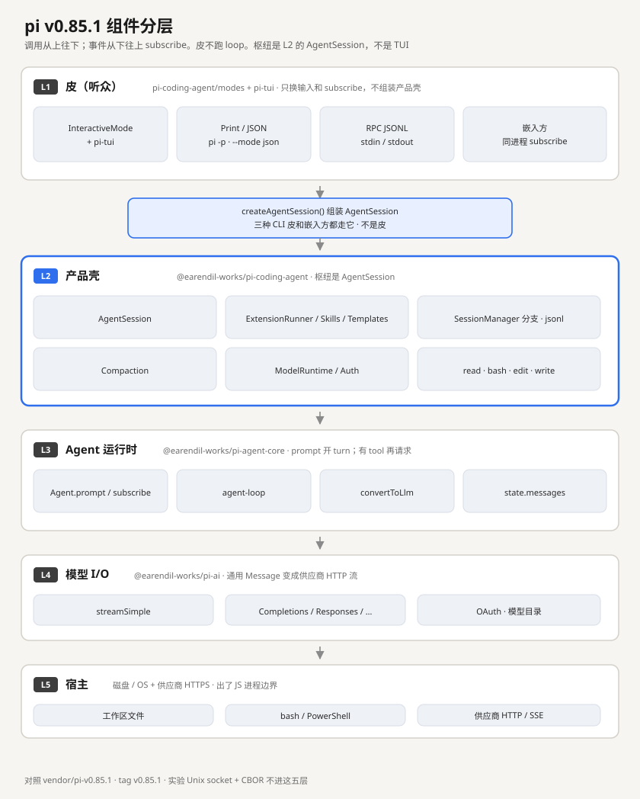
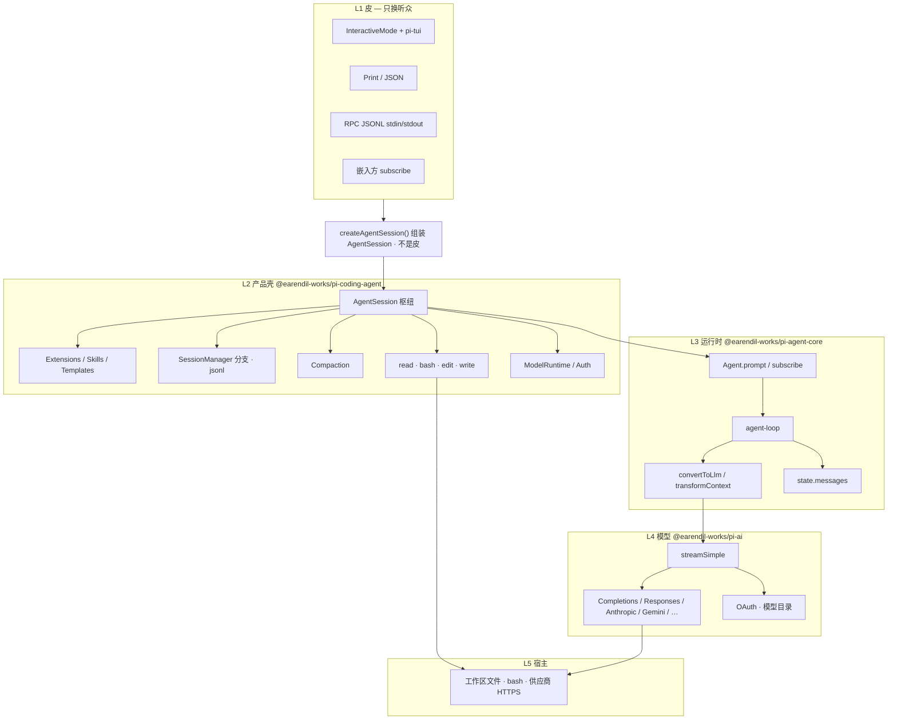

# 今天的 pi（v0.85.1）组件分层

对照课对齐的是 2025-08 首版 `packages/agent`。这份笔记把**一年后的产品**按 npm 包边界拆开，方便对照 `vendor/pi-v0.85.1/`，不要抄进 `reconstruct/`。

- 冻结点：Git tag **`v0.85.1`**（提交 `d981de1`，2026-09-05）
- 快照：[vendor/pi-v0.85.1/SNAPSHOT.md](../../vendor/pi-v0.85.1/SNAPSHOT.md)

读法：**皮不跑 loop。** 调用从上往下；事件从下往上 `subscribe`。枢纽是 L2 的 `AgentSession`，不是 TUI。`createAgentSession()` 是进 L2 的工厂，不是第四张皮。若一张图里的名字叠在一起，先读 [pi-growth.md](pi-growth.md)（三个 session、CLI 三种皮和嵌入方、cwd 和 `~/.pi/agent`）。Event、`role`、jsonl 的 `type` 叠在一起时读 [pi-messages.md](pi-messages.md)。JSONL RPC 和 SSE 的电线差：[demos/jsonl-rpc-vs-sse/](demos/jsonl-rpc-vs-sse/README.md)。

## 第 1 节：分层图

同一张关系用 mermaid 再画一遍（GitHub / 部分预览会渲染成图）：

一次 `prompt` 穿过这些层：

用户在皮里说一句话 → `AgentSession.prompt()` → `Agent.prompt()` → `agent-loop` 发 user 消息 → `convertToLlm()` → `pi-ai.streamSimple()` → 流式 `message_update` 回到 `subscribe` 听众 → 若有 tool call 则执行 `read` / `bash` / `edit` / `write` → 再请求，直到没有 tool call。

事件是生命周期（`agent_start` / `message_update` / `tool_execution_*`），不是 reconstruct 那种一条一条的 `tool_call` 流水账。UI 画的是 `Agent.state.messages`。

## 第 2 节：L1 皮（听众）

只换输入和 `subscribe`。CLI 三种皮由 `main.ts` 解析参数后选一个；已经在同一个 Node 里的程序自己当第四个听众。包：`pi-coding-agent/modes` + `pi-tui`（`pi-tui` 不在稀疏快照里，本仓库只看名字和依赖关系）。它们都不组装产品壳。

### InteractiveMode + `pi-tui`

人要在终端里连续对话：看流式字、切模型、敲 slash。loop 不该知道键盘和屏幕。

`InteractiveMode` 是 coding-agent 的胶水：订 `AgentSession` 事件，把 `state.messages` 交给 `pi-tui` 画。`pi-tui` 是独立包，差分渲染编辑器、Markdown、overlay。无参数跑 `pi` 就进这里。本仓库按规则**不做**这一块。

### Print / JSON

脚本和 CI 只要一次结果，不要 TUI。

`pi -p` 把终答打成文本后退出。`--mode json` 仍是同一份 `AgentSession` 事件，改成一行一条 JSON 写 stdout。和 reconstruct 的 `--json` 同类，命令表更瘦。

### RPC JSONL stdin/stdout

IDE / 自己的 Node 壳要驱动 Agent，但浏览器和 HTTP 都不是这条线的目标。

`pi --mode rpc`：stdin 一行一条带 `type` 和可选 `id` 的命令，stdout 回 `response` 和事件。宿主 spawn 子进程，用管道当电线。这是官方嵌入路径。

### 嵌入方 `subscribe`

已经在 Node 里的应用不必再 spawn `pi --mode rpc`。

皮是你的程序：`session.subscribe(听众)` 再 `prompt`。同进程函数调用，没有 JSONL 管道。旧 `pi-web-ui` 也是这种听众（Lit 订 L3），不是 HTTP。

## 第 3 节：L2 产品壳

coding 产品语义都在这层：会话文件、压缩、技能、默认四件工具、登录。皮不得直接操作这些。包：`@earendil-works/pi-coding-agent`。图上高亮的枢纽就是这里。

### `createAgentSession()`

三种 CLI 皮和嵌入方不能各自 `new Agent` 再挂一套工具。

工厂：扫 `ResourceLoader`、准备 `ModelRuntime` / `SessionManager`、`new Agent`、扣上 `AgentSession`。图上夹在 L1 和 L2 之间，**不是**第六层，也**不是**皮。CLI 经 `createAgentSessionRuntime` 也走它。`/new` `/resume` `/fork` 时毁掉旧的再造一个，是旁边的 Runtime，先别读。

### `AgentSession`

Interactive / Print / RPC / 嵌入方不能各写一套 prompt、压缩、切会话。

产品枢纽。手里握着 L3 的 `Agent` 和本层的 `SessionManager`；对外是 `prompt`、abort、切模型、compact、fork。事件是 core 的 `AgentEvent`，再加上 compaction / queue 等产品事件。皮只 `subscribe`。reconstruct 还没有抽出这一层，CLI 更接近直接调 loop。

### `ExtensionRunner`

官方故意不做内置 MCP、sub-agent、权限弹窗，把工作流留给扩展。

加载扩展、转发钩子（tool call 前后、session 生命周期）、登记 slash 和自定义工具。扩展改的是产品壳，不是 `agent-loop`。

### Skills

把可复用工作流写成 markdown，不必改源码、也不必上 MCP。

从 `~/.pi/agent/skills` 和项目 `.pi/skills` 读带 frontmatter 的技能文件，摘要写进 system prompt，用 `/skill:name` 展开后当用户消息送进 Agent。

### Prompt templates

常用提示词要能 `/名字` 展开；和技能分开：模板是填空提示，技能是带说明的工作流。

markdown 模板，斜杠补全时展开成 prompt，再交给 `AgentSession`。

### `SessionManager`

对话要落盘、能继续、能从某句分叉，不能只活在内存。

jsonl 会话树（version 3）：消息、模型变更、压缩摘要。header 可以挂 `parentSession`。和 reconstruct 的 jsonl 同类，多了分支。树怎么存、`/tree` 和 `/fork` 归谁管：[pi-sessions.md](pi-sessions.md)。

### Compaction

上下文窗口会满。截断会丢事实，所以改成摘要后再继续。

纯函数：找切点、调模型写摘要、`SessionManager` 追加一行再重建 `messages`。触发可以是手动、阈值或溢出。loop 本身不决定何时压。流程：[pi-compaction.md](pi-compaction.md)。

### `ModelRuntime` / Auth

Agent 不应自己读 `~/.pi/agent/auth.json` 或知道 OAuth 弹窗。

组装 `pi-ai` 的 `Models`：目录刷新、API key / 订阅登录、调用 `streamSimple` 时带上密钥和重试。`/login` 停在这层。

### `read` · `bash` · `edit` · `write`

coding agent 默认要能看文件、改文件、跑命令。首版的 `glob` / `rg` 不再当默认四件套。

`createCodingTools` 的四个 function tool：`read` 按行窗口读；`write` 整文件覆盖；`edit` 按 `oldText` / `newText` 打补丁；`bash` spawn 用户 shell。另有 `grep` / `find` / `ls` / `powershell`，只读模式或扩展才挂。reconstruct 更像首版：`read` / `list` / `bash` / `glob` / `rg`，改文件走 `bash`。

同层还有 `SettingsManager`、`ResourceLoader`、项目信任，图上没画：管配置、发现技能 / 扩展、问「这个目录能不能加载项目本地扩展」。

## 第 4 节：L3 Agent 运行时

和供应商无关的 harness。有 tool call 就本机执行再请求；只 emit，不按 type 做中央路由。这是对照课第 1–4 片对齐的那一层。包：`@earendil-works/pi-agent-core`。

### `Agent.prompt` / `subscribe`

调用方要一句 `prompt()` 开 turn，UI 要边跑边收事件，两者不能焊死。

`Agent` 持有 `systemPrompt`、`model`、`tools`、`messages`。`prompt()` 启动 loop；`subscribe()` 全量 fan-out，返回取消函数。对应 reconstruct 的 `ask` + `emitAll`。旧 `pi-web-ui` 的 `AgentInterface` 订的也是这个，不是 HTTP。

### `agent-loop`

turn 语义必须只有一份：皮、扩展、RPC 都不得再写一个「有 tool 就再请求」。

写入 user → 调模型 → 有 `tool_calls` 就执行（默认可并行）→ 再请求，直到没有。发出 `agent_start`、`message_update`、`tool_execution_*`、`turn_end`。取消走 `AbortSignal`，不要收成 `tool_result` + 失败。

### `convertToLlm` / `transformContext`

会话里可以有产品自己发明的 role（压缩摘要、`!bash`），模型 API 只吃 `user` / `assistant` / `toolResult`。这些 role 不是 Event：要留在画面上、还可能进下一轮 HTTP，所以写在 `messages` 里。人打 `!ls` 时皮认出 `!`，本地跑 `ls`，落下 `role: "bashExecution"`。形状和 jsonl 信封：[pi-messages.md](pi-messages.md)。

`transformContext` 可选：修剪或注入。`convertToLlm` 每轮必做：过滤并译成 LLM 的 `Message[]`。coding-agent 把自己的 `bashExecution`、compaction summary 译成一段 user 文本。

### `state.messages`

事件是生命周期（`agent_start` / `message_update`），不是 reconstruct 那种一条一条的流水账。画面和下一轮请求需要当前对话真相。

`Agent` 上的消息数组。TUI / 旧 web-ui 画这个，不画事件日志。`streamingMessage` 是正在流的半成品。reconstruct 的真相更多在 jsonl 事件账，再 `eventsToMessages` 译回去。

## 第 5 节：L4 模型 I/O

把「通用 `Message[]`」变成某家供应商的 HTTP 流，再收成统一的 assistant 事件。loop 不写 `fetch`。包：`@earendil-works/pi-ai`。

### `streamSimple`

Agent 只想要增量文本 / thinking / tool call，不想知道 Responses 和 Anthropic 的字节长得不像。

按 `model.api` 选 provider，返回 `AssistantMessageEventStream`。`AgentSession` 把 retry、超时、扩展改 header 的钩子包在这一次调用上。

### Completions / Responses / Anthropic / Gemini / …

每家信封不同（`chat/completions`、`responses`、`messages`），不能让 loop 分叉。

`pi-ai/api/*` 里各写一套 stream。reconstruct 手写了 Completions 和 Responses 两份，是同一思路的缩小版。

### OAuth · 模型目录

Claude Pro、ChatGPT、Copilot 不是一枚 API key；模型列表还会变。

内置供应商目录可刷新（`pi update --models`）。OAuth 设备码 / 浏览器登录。密钥不进 Agent 状态。

## 第 6 节：L5 宿主

出了 JS 进程边界。L2 的工具碰到磁盘和子进程；L4 的 stream 碰到公网。

### 工作区文件

`read` / `edit` / `write` 最终是 `fs`。Agent 不直接 `import fs`，经 tool 的 operations 才碰到路径。

默认相对 cwd。operations 可替换（例如 SSH）。没有内置权限弹窗，进程有当前用户的全部文件权限。

### bash / PowerShell

模型要跑测试、git、任意命令，不能只靠四个专用 tool。

spawn 用户 shell，截断 stdout，可超时。Windows 可换 PowerShell tool。取消要杀进程树；取消不是工具失败。

### 供应商 HTTP / SSE

token 在供应商那一侧产生，本机必须拉流。

HTTPS 调 OpenAI / Anthropic / Gemini 等。许多接口用 SSE 推 `chat.completion.chunk`。这是**模型流**，不是 Agent 事件的 HTTP SSE，也不是给 Cherry Studio 的网关。

## 第 7 节：和 reconstruct 对齐

| pi v0.85.1 | reconstruct（slice-07） |
|------------|-------------------------|
| L1 Interactive / Print / RPC | CLI 三种皮 |
| L1 嵌入方 `subscribe` | Go Gin `POST /ask` 是 HTTP 口，不是同进程订 `AgentSession` |
| `createAgentSession()` | 尚未抽工厂；CLI 直接调 loop |
| L2 `AgentSession` | 尚未抽这一层 |
| L3 `Agent` + `agent-loop` | `agent` + loop |
| L3 `subscribe` | `emitAll` 听众数组 |
| L2 `SessionManager` + jsonl | `session/manager` + `.sessions` |
| L2 `read` / `bash` / `edit` / `write` | `read` / `list` / `bash` / `glob` / `rg`（更像首版） |
| L4 `pi-ai` 多家信封 | Completions + Responses 两份手写 |
| L1 `pi-tui` | 不做 |

上表只对到层。逐项差距（已对齐 7 / 部分 8 / 未做 15 / 不做 1）：[pi-gap.md](pi-gap.md)。

## 第 8 节：实验侧路（不进这五层）

正式 npm 的 `pi` 二进制不含这条。开发仓里 `PI_EXPERIMENTAL=1` 才跑 server / client。

- 传输：本机 Unix socket（`.sock` 文件）+ `pi-protocol` 的长度前缀 CBOR
- 运行时：worker 进程里的 `AgentHarness`（比 shipping 的 `Agent` 更重）
- 浏览器走不了这根管子

另有 `mini`：同一思路，Unix socket 上走换行 JSON。已删除的 `pi-web-ui` 属于 L1 的另一种皮：同进程 Lit `subscribe` L3，不是 L5 上再开一个 HTTP 口。
